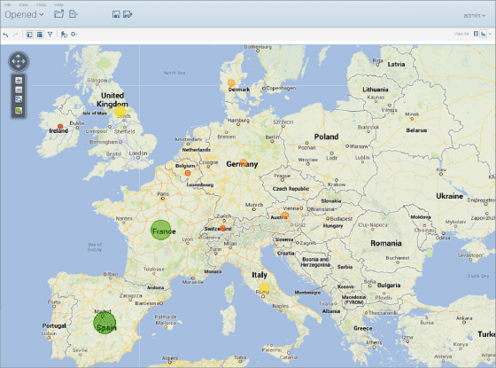
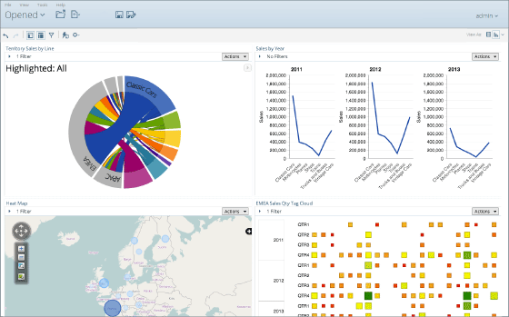
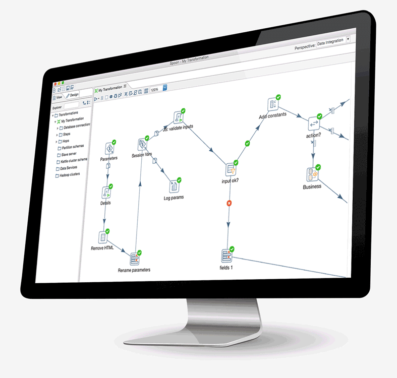

# Business Intelligence - Pentaho

|Author|Email|Date|
|------|-----|----|
|Van Quoc Mai|maiquocvan@gmail.com|April 7, 2017|

## About Pentaho
Pentaho, a Hitachi Group company, is a leading data integration and business analytics company with an enterprise-class, open source-based platform for diverse big data deployments. 

## Objective
Researching all Pentaho products.

## Details
Pentaho products are a comprehensive platform from which you can access, integrate, manipulate, visualize, and analyze your data. Whether data is stored in a flat file, relational database, Hadoop cluster, NoSQL database, analytic database, social media streams, operational stores, or in the cloud, the Pentaho products help you discover, analyze, and visualize data to find the answers you need -- even if you have no coding experience. More advanced users can customize reports, queries, transformations, or extend functionality using our extensive API if you have programming experience.

The Pentaho products consist of Business Analytics (BA) and Data Integration (DI) components. Which components you use depend on your workflow and what your environment supports:

### Pentaho Business Analytics
The BA (Business Analytics) components to Pentaho help you create compelling visualizations, reports, and dashboards, based on data models that you design.

     
### Pentaho Data Integration
Pentaho Data Integration (PDI) provides the Extraction, Transformation, and Loading (ETL) capabilities that facilitates the process of capturing, cleansing, and storing data using a uniform and consistent format that is accessible and relevant to end users and IoT technologies.

### Big Data
Pentaho provides a complete big data analytics solution that supports the entire big data analytics process. From big data aggregation, preparation, and integration, to interactive visualization, analysis, and prediction, Pentaho allows you to harvest the meaningful patterns buried in big data stores.

